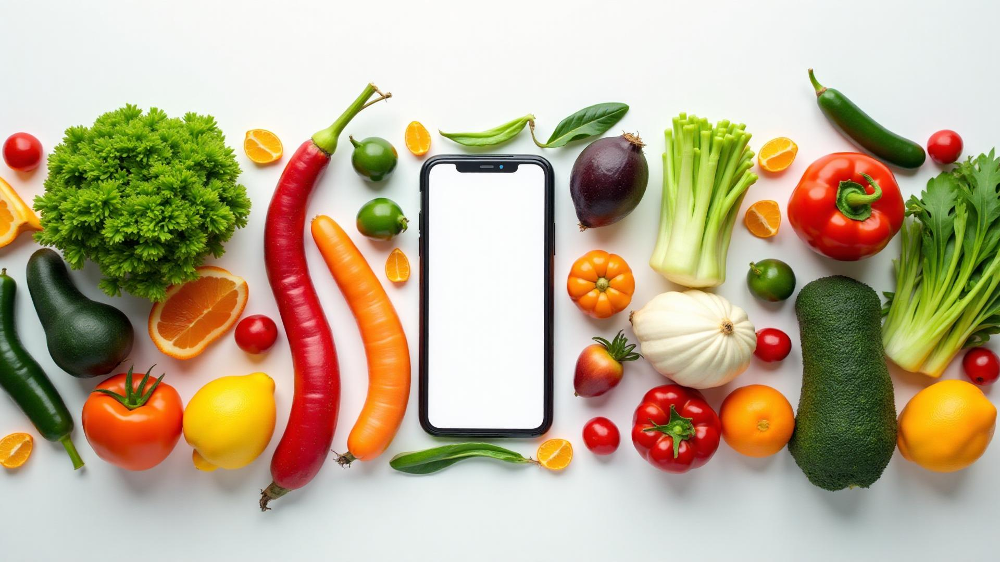

# 🍽️ Nutri-Vision AI - Frontend



**AI-Powered Nutrition Planner & Food Recognition System**

A comprehensive React.js frontend for the Nutri-Vision AI nutrition planning application, featuring food recognition, meal planning, progress tracking, and nutritionist consultations.

## 🌟 Features

### 🎯 Core Features
- **🤖 AI Food Recognition** - Upload food images for instant recognition and nutrition analysis
- **📊 Personalized Dashboard** - Track meals, calories, and nutrition progress
- **🍽️ Smart Meal Planner** - AI-powered meal recommendations using Llama 3.1
- **📈 Progress Tracking** - Visual charts and analytics for nutrition goals
- **👨‍⚕️ Nutritionist Consultations** - Video calls and appointment booking
- **📱 Responsive Design** - Mobile-first, works on all devices

### 🔐 User Management
- **Multi-role Authentication** - Patients, Nutritionists, and Admins
- **Secure Login/Registration** - JWT-based authentication
- **Profile Management** - Customizable user profiles and preferences
- **Admin Dashboard** - User management and system oversight

### 🎥 Communication Features
- **Video Calls** - WebRTC integration for nutritionist consultations
- **Real-time Chat** - Instant messaging during appointments
- **Appointment Scheduling** - Book and manage nutritionist sessions
- **Payment Integration** - QR code payments for consultations

## 🛠️ Tech Stack

- **Frontend Framework:** React 18.2.0
- **Build Tool:** Vite 4.4.5
- **Styling:** Tailwind CSS 3.3.3
- **Routing:** React Router DOM 6.15.0
- **Charts:** Chart.js + React-Chartjs-2
- **Forms:** React Hook Form 7.45.4
- **HTTP Client:** Axios 1.5.0
- **Real-time:** Socket.IO Client 4.8.1
- **Icons:** Lucide React 0.263.1
- **Notifications:** React Hot Toast 2.4.1

## 🏗️ Project Structure

```
src/
├── components/          # Reusable UI components
│   ├── auth/           # Authentication components
│   ├── appointments/   # Appointment booking components
│   ├── communication/  # Chat and call components
│   ├── layout/         # Navigation and layout
│   └── admin/          # Admin dashboard components
├── pages/              # Route components
│   ├── auth/           # Login/Register pages
│   ├── admin/          # Admin dashboard pages
│   └── appointments/   # Appointment pages
├── contexts/           # React Context providers
├── hooks/              # Custom React hooks
├── services/           # API service functions
├── utils/              # Utility functions
└── styles/             # CSS and styling files
```

## 🚀 Getting Started

### Prerequisites
- Node.js >= 18.0.0
- npm >= 9.0.0

### Installation

1. **Clone the repository**
   ```bash
   git clone https://github.com/your-username/nutri-vision-frontend.git
   cd nutri-vision-frontend
   ```

2. **Install dependencies**
   ```bash
   npm install
   ```

3. **Set up environment variables**
   ```bash
   # Copy environment template
   cp .env.local.example .env.local
   
   # Edit .env.local with your API endpoints
   VITE_API_URL=http://localhost:5001/api
   VITE_AI_API_URL=http://localhost:8002
   VITE_OLLAMA_API_URL=http://localhost:8003
   ```

4. **Start development server**
   ```bash
   npm run dev
   ```

5. **Open your browser**
   ```
   http://localhost:3000
   ```

## 🌐 Deployment

### Vercel (Recommended)

This project is optimized for Vercel deployment:

1. **Install Vercel CLI**
   ```bash
   npm install -g vercel
   ```

2. **Login and deploy**
   ```bash
   vercel login
   vercel --prod
   ```

3. **Set environment variables in Vercel dashboard:**
   - `VITE_API_URL` - Your backend API URL
   - `VITE_AI_API_URL` - Your AI service URL  
   - `VITE_OLLAMA_API_URL` - Your Ollama service URL

### Build for Production

```bash
# Create production build
npm run build

# Preview production build
npm run preview
```

## 🔧 API Integration

The frontend integrates with multiple backend services:

### Backend Services
- **Main API (Railway):** User management, authentication, meal plans
- **AI Service (Hugging Face Spaces):** Food recognition and nutrition analysis
- **Ollama Service (Railway):** AI meal recommendations using Llama 3.1
- **Database (MongoDB Atlas):** Data persistence

### API Configuration
```javascript
// src/services/api.js
const API_BASE_URL = import.meta.env.VITE_API_URL
const AI_API_URL = import.meta.env.VITE_AI_API_URL
const OLLAMA_API_URL = import.meta.env.VITE_OLLAMA_API_URL
```

## 📱 Key Pages

- **`/`** - Landing page with feature overview
- **`/dashboard`** - User dashboard with nutrition overview
- **`/food-scanner`** - AI food recognition interface
- **`/meal-planner`** - AI-powered meal planning
- **`/progress`** - Nutrition tracking and analytics
- **`/appointments`** - Nutritionist booking and management
- **`/nutritionist/dashboard`** - Nutritionist interface
- **`/admin/dashboard`** - Admin management panel

## 🧪 Development

### Available Scripts

```bash
npm run dev          # Start development server
npm run build        # Build for production
npm run preview      # Preview production build
npm run lint         # Run ESLint
npm test             # Run tests
```

### Code Quality
- **ESLint** configuration for code quality
- **Prettier** for consistent formatting
- **React DevTools** support
- **Hot Module Replacement** for fast development

## 🌟 Features in Detail

### 🍔 Food Recognition
- Upload food images via camera or file selection
- Real-time AI analysis using computer vision
- Detailed nutritional breakdown per 100g
- Confidence scoring for predictions

### 📊 Dashboard Analytics
- Daily/weekly/monthly nutrition tracking
- Interactive charts using Chart.js
- Goal setting and progress monitoring
- Meal history and patterns

### 🤖 AI Meal Planning
- Personalized meal recommendations
- Dietary preference consideration
- Calorie and macro-nutrient optimization
- Integration with Ollama and Llama 3.1

### 👨‍⚕️ Nutritionist Platform
- Professional dashboard for nutritionists
- Patient management and consultation history
- Video call integration with WebRTC
- Appointment scheduling and payment tracking

## 🔒 Security Features

- **JWT Authentication** - Secure token-based auth
- **Route Protection** - Private routes for authenticated users
- **Role-based Access** - Different permissions for users/nutritionists/admins
- **Input Validation** - Form validation and sanitization
- **HTTPS Enforcement** - Secure communication in production

## 📈 Performance Optimizations

- **Code Splitting** - Route-based lazy loading
- **Bundle Optimization** - Webpack optimization and tree shaking
- **Asset Caching** - Long-term caching for static assets
- **Image Optimization** - Compressed images and modern formats
- **PWA Ready** - Service worker and offline capabilities

## 🤝 Contributing

1. Fork the repository
2. Create your feature branch (`git checkout -b feature/AmazingFeature`)
3. Commit your changes (`git commit -m 'Add some AmazingFeature'`)
4. Push to the branch (`git push origin feature/AmazingFeature`)
5. Open a Pull Request

## 📄 License

This project is licensed under the MIT License - see the [LICENSE](LICENSE) file for details.

## 🙏 Acknowledgments

- **React Team** for the amazing framework
- **Vite** for blazing fast development
- **Tailwind CSS** for utility-first styling
- **Chart.js** for beautiful charts
- **Lucide** for consistent icons

---

**🎯 Built with ❤️ for healthier eating choices**

For backend repository, visit: [Nutri-Vision Backend](https://github.com/your-username/nutri-vision-backend)

For AI models, visit: [Nutri-Vision AI](https://huggingface.co/spaces/your-username/nutrivision-ai)